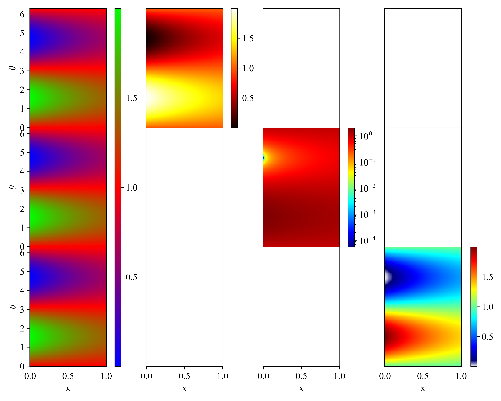

# PhantomRevealer.jl

A Julia interface for analyzing dump files from the Phantom Smoothed Particle Hydrodynamics code.

Most of the analysis is based on SPH interpolation. Check out Price(2010) for further information.

## Installation

### 1. Install Julia

Julia is required before installing this package. You can check this website: [Julia Downloads](https://julialang.org/downloads/) for further information.

After installing Julia, type 

```bash
julia
```
to start the julia REPL. 

### 2. Install package
In the Julia REPL, activate the Pkg module to install the package:

```julia
using Pkg
```

Next, install this package directly from the Git repository:
```julia
Pkg.add(url="https://github.com/weishansu011017/PhantomRevealer.jl.git")
```

## Usage

### Read Phantom dumpfiles

To read the dumpfiles to the Julia environment, importing this package by typing

~~~julia
using PhantomRevealer
~~~

Next, loading your dumpfiles

~~~julia
filepath :: String = "/path/to/your/dumpfile"
prdf_list :: Vector{PhantomRevealerDataFrame} = read_phantom(filepath, "all")
~~~

You will get the vector that contains all of the particles in a Sarracen-alike dataframes structure, which is named as `PhantomRevealerDataFrame`,  with the separation of different type of particles. 

Note that the final element in this vector will always be the data of sinks particles (if exist.)

The structure of `PhantomRevealerDataFrame` is shown below:

~~~julia
struct PhantomRevealerDataFrame <: PhantomRevealerDataStructures
    dfdata::DataFrame
    params::Dict
end
~~~

The table of particles is stored in the `dfdata` field, and the other information of this simulation, including mass of particles, time...etc, can be found in the `params` field.

For example, to get the unit of mass in the code unit, type

~~~julia
umass :: Float64 = prdf_list[1].params["umass"]
~~~

to get the unit mass in cgs.

Just like sarracen, it is easy to add more quantity for each particles. **PhantomRevealer** provide some inbulid method. For instance, adding the position and velocity in cylindrical coordinate by entering

~~~julia
add_cylindrical!(prdf_list[1])
~~~

Note that **any fucntion/method name that includes `!` in PhantomRevealer mean that the function would change the inner state of first argument/input**. Becareful if you don't want to change the value, or just copy the variable by

~~~julia
Copy_data = deepcopy(prdf_list[1])
~~~


Beside, the coordinate transformation that shifts the origin to the positional of specific sinks particles is provied

~~~julia
sinks_data :: PhantomRevealerDataFrame = prdf_list[end]
COM2star!(prdf_list, sinks_data, 1)
~~~

This statement would change the whole coordinate into the new coordinate with the sinks particle in first row locating at the origin. The current coordinate can be checked by

~~~julia
prdf_list[1].params["COM_coordinate"]
prdf_list[1].params["Origin_sink_id"]
prdf_list[1].params["Origin_sink_mass"]
~~~

if the coordinate is in COM point of view. These value would be in 

~~~julia
>> [0.0, 0.0, 0.0]
>> -1
>> NaN
~~~

otherwise, they will give their coorespoding result.

### K-dimensional tree (KD-Tree) structure support

In some of the calculation, we would like to filter some of the particles to reduce the calculation. However, taking the geometry distance calculation directly will lead to a $\mathcal{O}(n^2)$ time complexity. Therefore, **PhantomRevealer** provides a method to filter your `PhantomRevealerDataFrame` which is based on K-dimensional tree structure that is provided by `Neighborhood.jl`(https://github.com/JuliaNeighbors/Neighborhood.jl). To start with, generate the kd-tree by following

~~~julia
kdtree3d :: KDTree = Generate_KDtree(data, dim=3)
kdtree2d :: KDTree = Generate_KDtree(data, dim=2)
~~~

Next, filtering the data by entering

~~~julia
target :: Vector = [10.0, π/4, 0.0]   # In cylindrical coordinate (s, ϕ, z) for exmaple.
radius :: Float64 = 2.5

filtered_data :: PhantomRevealerDataFrame = KDtree_filter(data, kdtree3d, target, radius, "polar" )  # You can change the final input to "cart" if the `target` input is in cartisian coordinate.
~~~

### Grid generator

We would like to look at the quantities at an arbitrary point in a grid; therefore, a grid generator is necessary. In **PhantomRevealer**, the grid structure is designed as 

~~~julia
struct gridbackend
    grid::Array
    axes::Vector{LinRange}
    dimension::Vector{Int64}
end
~~~

where `grid` field can store the value of quantities on each point, and the coordinate of each element is defined by the axes in `axes` field. The `dimension` field provies the size of this array.

To generate this grid automatically, entering

~~~julia
imin :: Vector{Float64} = [10.0, 0.0]     # The minimum value of each axes
imax :: Vector{Float64} = [120.0, 2π]			# The maximum value of each axes
in :: Vector{Float64} = [181, 301]				# The number of separation of each axes
type :: Type = Float64

test_grid :: gridbackend = generate_empty_grid(imin, imax, in ,type)
~~~

For a disk-shape grid, a useful function is provied

~~~julia
grid :: gridbackend = disk_2d_grid_generator(imin, imax, in)
~~~

the `grid` is equivalent to `test_grid`

### SPH interpolation

In SPH, an arbitrary quantity $\mathbf{A}(\mathbf{r})$ can be interpolated by the following formula.
```math
\mathbf{A}(\mathbf{r}) \approx \sum_b \frac{\mathbf{A}_b}{\rho_b} W(|\mathbf{r}-\mathbf{r}_b|; h)
```
Where $W$ is the kernel function, and the $h$ is the smoothed radius. **PhantomRevealer** provides 6 kernel functions: $M_4$ B-Spline, $M_5$ B-Spline, $M_6$ B-Spline, Wendland $C_2$, Wendland $C_4$ and Wendland $C_6$. The smoothed radius $h$​ for each point can be determine by two ways: taking the average of all of the particles `"mean"`, choosing the smoothed radius of closest particles to the target`"closest"`.

Moreover, the first derivative SPH interpolations are also provided, including gradient, divergence and curl by the following formulas
$$
\nabla A(\mathbf{r}) = \frac{1}{\rho(\mathbf{r})}\sum_b m_b (A_b - A(\mathbf{r})) \nabla W(\mathbf{r} - \mathbf{r}_b; h)\\
\nabla \cdot \mathbf{A}(\mathbf{r}) = \frac{1}{\rho(\mathbf{r})}\sum_b m_b (\mathbf{A}_b - \mathbf{A}(\mathbf{r})) \cdot\nabla W(\mathbf{r} - \mathbf{r}_b; h)\\
\nabla \times \mathbf{A}(\mathbf{r}) = -\frac{1}{\rho(\mathbf{r})}\sum_b m_b (\mathbf{A}_b - \mathbf{A}(\mathbf{r})) \times\nabla W(\mathbf{r} - \mathbf{r}_b; h)\\
$$
These formulas are derived by using the general first derivative operator in Price(2010) (Equation (76) (79) (80)), by taking $\phi = \rho$ in the formulas. 


### File extraction

The interpolation result needs to be extracted. A structure is designed to saving these result, extracting to a **HDF5** format.

~~~julia
struct Analysis_result_buffer <: PhantomRevealerDataStructures
    time::Float64
    data_dict::Dict{Int,gridbackend}
    axes::Vector{LinRange}
    column_names::Dict{Int,String}
    params::Dict{String,Any}
end

mutable struct Analysis_result <: PhantomRevealerDataStructures
    time::Float64
    data_dict::Dict{Int,Array{Float64}}
    axes::Dict{Int,Vector{Float64}}
    column_names::Dict{Int,String}
    params::Dict{String,Any}
end
~~~

You can transfer the `buffer` structure into the normal structure with some data testament by

~~~julia
result_buffer :: Analysis_result_buffer(SOMEPARAMETER...)  # Check out the section "Example 1" for further invesgation!
result :: Analysis_result = buffer2output(result_buffer)
~~~

After generateing the `Analysis_result` , the data can be written out by

~~~julia
Write_HDF5(Analysis_tag, filepath, result, "TEST")
~~~

Note that the parameter `Analysis_tag` would be recorded inside the `param` fields to manage the output file into different usage.

The `filepath` is used for extracting the step of simulation to prevent conflicting among different output e.g "disc_00100" -> "00100".

The `data_prefix` is the `PREFIX` part in the result string `PREFIX_00XXX.h5`

The output dump files can be loaded by `Read_HDF5()`.

~~~julia
result = Read_HDF5(filepath)
~~~


#### Example : Disk interpolation
Our goal is to interpolating a disk-shape (annulus) grid from a dumpfile `disc_00000` which including gaseous and dusty particles. We should also calculate the mid-plane average of density `rho` and velocity `vs, vϕ` . Here is a example to do it.

~~~julia
function Disk_Faceon_interpolation(filepath :: String)
    @info "-------------------------------------------------------"
    # ------------------------------PARAMETER SETTING------------------------------
    Analysis_tag :: String = "Faceon_disk"
    # parameters of radial axis
    smin :: Float64 = 10.0
    smax :: Float64 = 175.0
    sn :: Int64 = 331
    
    # parameters of azimuthal axis
    ϕmin :: Float64 = 0.0
    ϕmax :: Float64 = 2π
    ϕn :: Int64 = 351
  
    # Other parameters
    column_names :: Vector{String} = ["e"]									# The quantities that would be interpolate except for surface density `Sigma`.
    mid_column_names :: Vector{String} = ["rho","vs","vϕ","vz","vϕ-vϕ_k"]   # The quantities that would be interpolate in the midplane.
    Origin_sinks_id :: Int64 = 1											# The id of sink at the middle of disk for analysis.
    smoothed_kernel :: Function = M6_spline
    h_mode :: String = "closest"
    DiskMass_OuterRadius :: Float64 = 175.0                                 # The outer radius of disk while estimating the mass of disk

    # Output setting
    File_prefix :: String = "Faceon"
    # -----------------------------------------------------------------------------
    # Packaging parameters
    sparams :: Tuple{Float64,Float64,Int} = (smin, smax, sn)
    ϕparams :: Tuple{Float64,Float64,Int} = (ϕmin, ϕmax, ϕn)
    columns_order :: Vector = ["Sigma", "∇Sigmas", "∇Sigmaϕ", column_names..., (mid_column_names.*"m")...] # construct a ordered column names (Those quantities with taking mid-plane average will have a suffix "m")
    
    # Load file
    prdf_list :: Vector{PhantomRevealerDataFrame} = read_phantom(filepath, "all")
    COM2star!(prdf_list, prdf_list[end], Origin_sinks_id)
    datag :: PhantomRevealerDataFrame = prdf_list[1]
    datad :: PhantomRevealerDataFrame = prdf_list[2]
    sinks_data :: PhantomRevealerDataFrame = prdf_list[3]
    
    # Add extra quantity for interpolation 
    add_cylindrical!(datag)
    add_cylindrical!(datad)
    add_eccentricity!(datag)
    add_eccentricity!(datad)
    add_Kepelarian_azimuthal_velocity!(datag)
    add_Kepelarian_azimuthal_velocity!(datad)

    
    # Make the `params` field
    time :: Float64 = get_time(datag)
    params :: Dict{String, Any} = Analysis_params_recording(datag)
    params["GasDiskMass"] = get_disk_mass(datag, sinks_data, DiskMass_OuterRadius, Origin_sinks_id)
    params["DustDiskMass"] = get_disk_mass(datad, sinks_data, DiskMass_OuterRadius, Origin_sinks_id)
    
    # Calculate the midplane of gaseous disk
    if isempty(mid_column_names)
        midz_func = nothing
        midz_gbe = nothing
    else
        midz_func = Disk_2D_midplane_function_generator(datag,(10.0,smax, 166))
        # Transfer the midplane interpolation function into gridbackend.
        imin = [smin,ϕmin]
        imax = [smax,ϕmax]
        in = [sn,ϕn]
        midz_gbe = func2gbe(func=midz_func, imin, imax,in)
    end

    # Interpolation
    grids_gas :: Dict{String, gridbackend} = Disk_2D_FaceOn_Grid_analysis(datag, sparams, ϕparams, column_names=column_names, mid_column_names=mid_column_names, midz_func=midz_func, smoothed_kernel=smoothed_kernel, h_mode=h_mode)
    grids_dust :: Dict{String, gridbackend} = Disk_2D_FaceOn_Grid_analysis(datad, sparams, ϕparams, column_names=column_names, mid_column_names=mid_column_names, midz_func=midz_func, smoothed_kernel=smoothed_kernel, h_mode=h_mode)
    
    # Combine these dictionaries of grids with suffix
    final_dict = create_grids_dict(["g","d"], [grids_gas, grids_dust])

    # Packaging the result
    Result_buffer :: Analysis_result_buffer = Analysis_result_buffer(time, final_dict, columns_order, params, midz_gbe)
    Result :: Analysis_result = buffer2output(Result_buffer)
    
    # Write out the result to HDF5
    Write_HDF5(Analysis_tag,filepath, Result, File_prefix)
    @info "-------------------------------------------------------"
end
~~~

### Built-in plotting tools

**Important Notification:** After *0.9.0*, the old matplotlib-based plotting backend are discarded due to a fatal issue while calling Python from Julia.

**PhantomRevealer.jl** provides a built-in plotting tools based on a well-known interactive plotting package **Makie.jl**, which wraps certian common-used plotting tools, including:

1. Wrapping the `Figure` and several common-used object to manage the plotting object easier.
2. Automatic setup the axis in the figure. More intuitive way to plotting on axes.
3. Easier colorbar setup by automatically detecting the position of axis in the `Figure` object.
4. Polar Heatmap while using `GLMakie`. (Exprienmental but useful)

The basic block in the tools is the `FigureAxes` object.

```julia
mutable struct FigureAxes <: PhantomRevealerDataStructures
    fig :: Figure
    axes :: Matrix{Union{Nothing,Makie.Block}}
    axes_type :: Matrix{String}
    screen :: Union{Nothing, GLMakie.Screen}
end
```

Where `fig` is the main `Figure` object that contains the plots, `axes` is a matrix representing the relative position of axis among all `Axis`-alike object. `axes_type` is a matrix that stores the type of each axis as a string. This can be used to track different axis configurations (e.g., "Cartesian", "Polar", "3D"). The `screen` represents the `GLMakie.Screen` object associated with the figure, used when rendering interactive visualizations. `Nothing` if no screen is assigned.

User can easily construct `FigureAxes` by calling the function

```julia
function FigureAxes(nrows::Int64,ncols::Int64;
    figsize::Tuple{Int64,Int64}=(8,6),
    sharex::Bool = true, sharey::Bool = true,
    polar_axis::Union{Nothing,Matrix{Bool}}=nothing,ThreeDim_axis::Union{Nothing,Matrix{Bool}}=nothing)
```

By passing the matrix with size `(nrows, ncols)` into the constructing function, the type of each axis can be contructed into either `Axis`(Cartesian), `PolarAxis`(Polar) or `Axis3`(3-dimensional). The corresponding type of axis would be recorded inside the `axes_type` fields. 

Two kinds of backend can be selected: `CairoMakie` and `GLMakie`. `CairoMakie` is sutible for **plotting vector graphics** such as `.svg` and `.pdf`, while `GLMakie` is for **interactive operation**. Use either `using CairoMakie` or `using GLMakie` at the beginning of your script to select the backend. If using both in your script, make sure to call

```julia
activate_backend("GL")    # or "Cairo"
```

to select the backend that you would likely to use. 

#### Example : Usage of built-in plotting backend 

A simple usage for plotting is shown as following

```julia
using PhantomRevealer, GLMakie, LaTeXStrings
activate_backend("GL")  # Activate the GLMakie backend for interactive visualization

# Define coordinate grids
x = LinRange(0.0,1.0,100)  # X-axis values ranging from 0 to 1 with 100 points
y = LinRange(0.0,2π,150)   # Y-axis values ranging from 0 to 2π with 150 points

# Define the Z matrix as a 2D function of (x, y)
z = [sin(yj)*exp(-xi)+1.0 for xi in x, yj in y]  # A damped sine function with an exponential decay

# Define colormap settings for different plots
z12cmap = "hot"      # Colormap for subplot (1,2)
z23cmap = "jet"      # Colormap for subplot (2,3)
z34cmap = "jet"      # Colormap for subplot (3,4) with a white base
zc1 = "brg"          # Colormap for multiple subplots (column 1)

# Define the grid layout of the figure
nr = 3  # Number of rows
nc = 4  # Number of columns
Fax = FigureAxes(nr, nc, figsize=(10,8))  # Create a figure with the specified grid layout and figure size

# Create a pseudocolor plot (heatmap) in subplot (1,2)
lazypcolor!(Fax, (1,2), x, y, z, colormap=z12cmap)
set_colorbar!(Fax, (1,2))  # Add a colorbar for subplot (1,2)

# Create a pseudocolor plot (heatmap) in subplot (2,3) with a logarithmic color scale
lazypcolor!(Fax, (2,3), x, y, z, colormap=z23cmap, colorscale=log10)
set_colorbar!(Fax, (2,3))  # Add a colorbar for subplot (2,3)

# Create a pseudocolor plot (heatmap) in subplot (3,4) with a colormap that has a white base
lazypcolor!(Fax, (3,4), x, y, z, colormap=colormap_with_base(z34cmap, to_white=true))
set_colorbar!(Fax, (3,4))  # Add a colorbar for subplot (3,4)

# Create multiple pseudocolor plots (heatmaps) in column 1 using the same colormap
lazypcolor!(Fax, (1,1), x, y, z, colormap=zc1)   
lazypcolor!(Fax, (2,1), x, y, z, colormap=zc1)   
lazypcolor!(Fax, (3,1), x, y, z, colormap=zc1)   

# Set a shared colorbar for the plots in rows 1, 2, and 3 of column 1
set_colorbar!(Fax, (1,1), mutiaxes_extend_range=1:3)

# Set axis labels
set_xlabel!(Fax, "x")             # Set the x-axis label
set_ylabel!(Fax, L"\theta")       # Set the y-axis label (using LaTeX formatting)

# Render the figure
draw_Fig!(Fax)  # Draw the figure with all configured subplots

```

The result would be as following.




## Relative links

Phantom homepage: [Phantom SPH](https://phantomsph.github.io)

Sarracen documentation: [Sarracen Documentation](https://sarracen.readthedocs.io/en/latest/)

Makie documentation: [Makie Documentation](https://docs.makie.org/stable/)

## References

[1]:[Smoothed Particle Hydrodynamics and Magnetohydrodynamics ](https://ui.adsabs.harvard.edu/abs/2012JCoPh.231..759P/abstract) (Daniel J. Price,.  *Journal of Computational Physics, Volume 231, Issue 3, p. 759-794.* 2012)

[2]:[How Efficient Is the Streaming Instability in Viscous Protoplanetary Disks?](https://ui.adsabs.harvard.edu/abs/2020ApJ...891..132C/abstract) (Ken Chen, Min-Kai Lin,. *The Astrophysical Journal,  Volume 891, Issue 2, id.132, 17 pp.* 2020)
